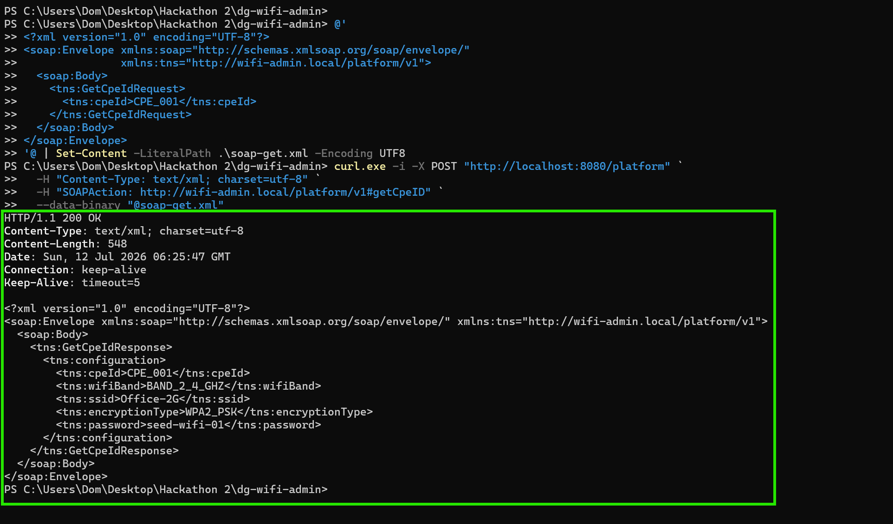
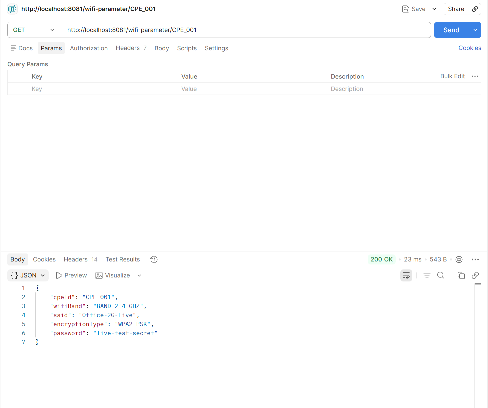
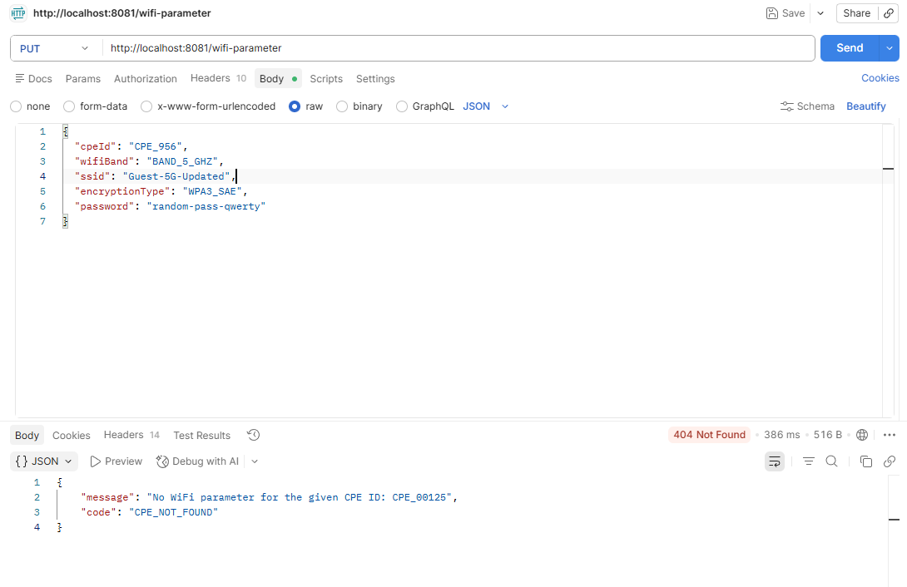
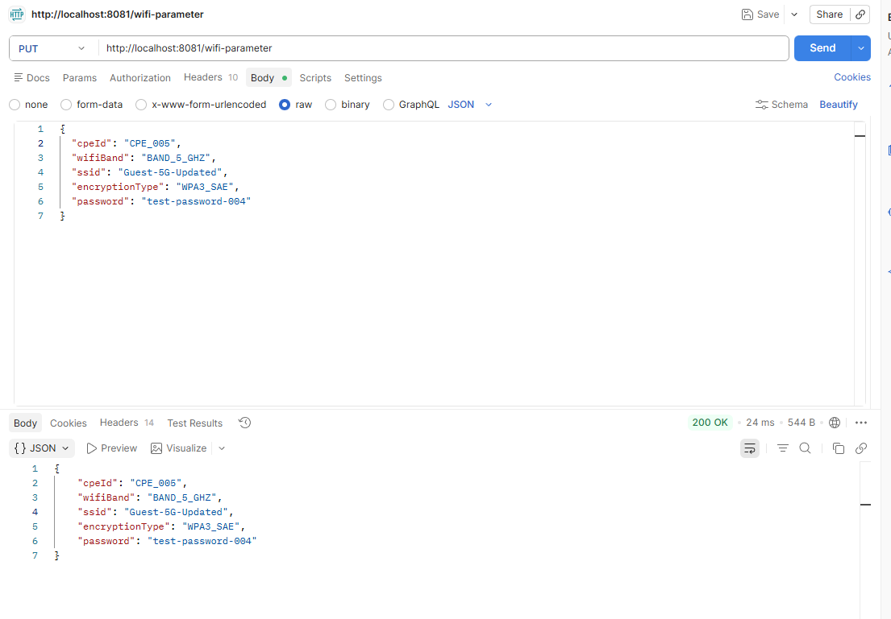
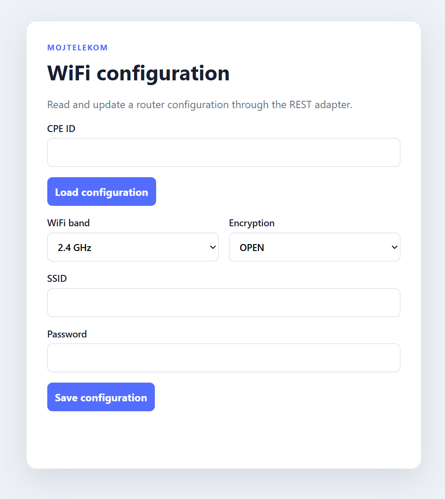
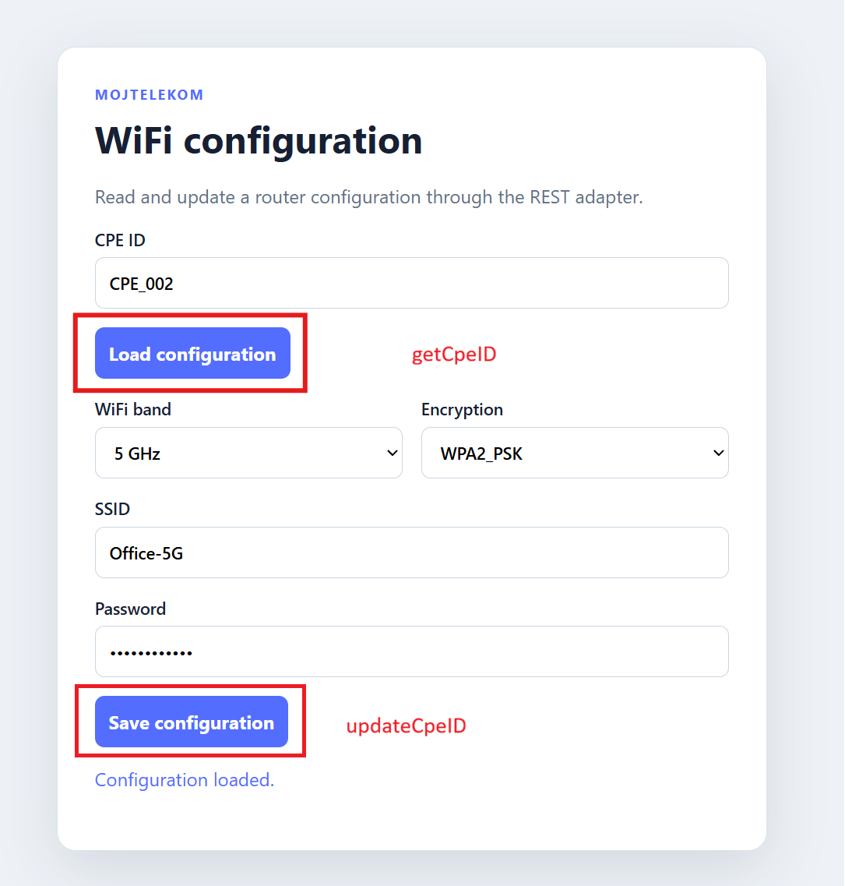
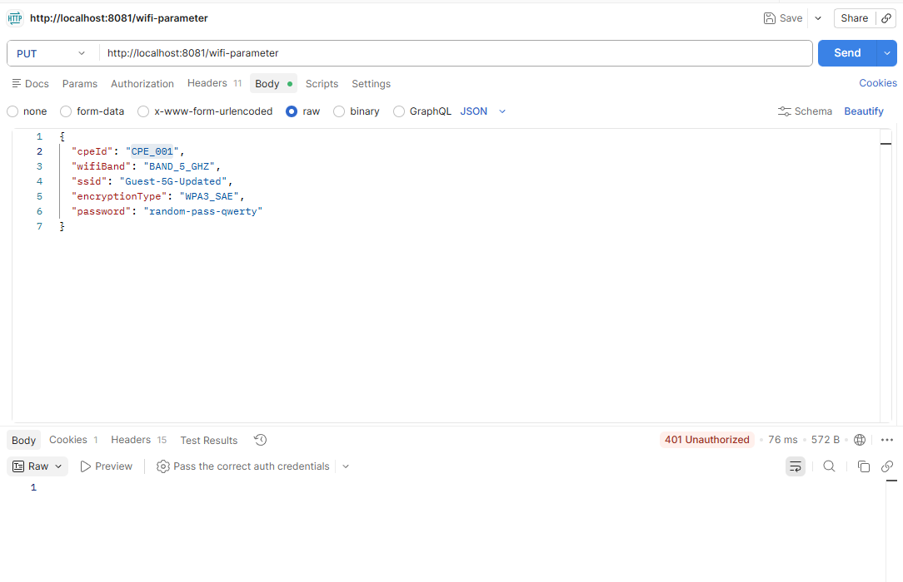
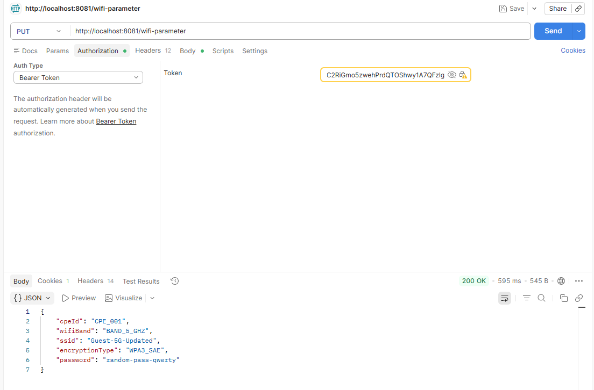

# Manual validation

This document records the manual validation flow for the WiFi administration service. The screenshots are stored in [`docs/manual-validation/`](manual-validation/) and are ordered by validation step.

## Step 0 - SOAP Platform response validation

The SOAP platform request for `CPE_001` returned `HTTP/1.1 200 OK` with the expected CPE configuration in the XML response.

## Step 1 - REST API GET wifi parameter proper

The REST adapter successfully returned the WiFi configuration for `CPE_001` with `200 OK`.

## Step 2 - REST API PUT WiFi parameter

### Unknown CPE ID

The negative PUT request returned `404 Not Found` with the `CPE_NOT_FOUND` error response.

### Successful update

The valid PUT request returned `200 OK` and the updated WiFi configuration.

## Step 3 - Frontend

### Empty form

The frontend initially displays an empty WiFi configuration form with controls for the CPE ID, WiFi band, encryption, SSID, and password.

### Frontend logic

The frontend loads the configuration with the `getCpeId` action and saves changes with the `updateCpeId` action. The screenshot shows a loaded configuration and the success status message.

## Step 4 - Authorization enabled

### Unauthorized request

When authorization is missing or invalid, the REST API returns `401 Unauthorized`.

### Authorized request

With a bearer token configured, the request returns `200 OK` and the WiFi configuration response.

